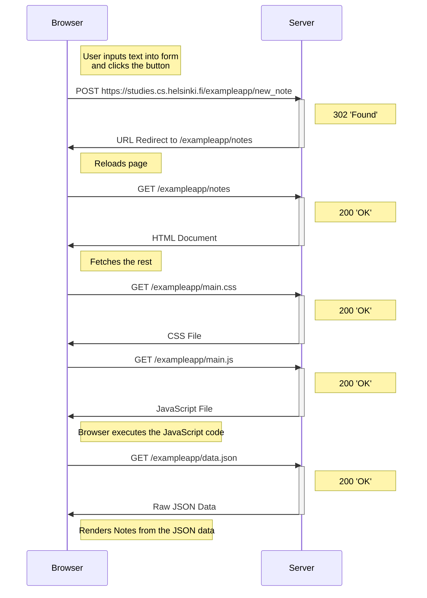

```mermaid
   sequenceDiagram
        participant  Browser
        participant Server

        Note right of Browser: User inputs text into form <br/> and clicks the button
        Browser ->> Server: POST https://studies.cs.helsinki.fi/exampleapp/new_note

        activate Server
        Note right of Server: 302 'Found'
        Server ->> Browser: URL Redirect to /exampleapp/notes
        deactivate Server

        Note right of Browser: Reloads page
        Browser ->> Server: GET /exampleapp/notes

        activate Server
        Note right of Server: 200 'OK'
        Server ->> Browser: HTML Document
        deactivate Server

        Note right of Browser: Fetches the rest
        Browser ->> Server: GET /exampleapp/main.css

        activate Server
        Note right of Server: 200 'OK'
        Server ->> Browser: CSS File
        deactivate Server

        Browser ->> Server: GET /exampleapp/main.js

        activate Server
        Note right of Server: 200 'OK'
        Server ->> Browser: JavaScript File
        deactivate Server

        Note right of Browser: Browser executes the JavaScript code
        

        Browser ->> Server: GET /exampleapp/data.json

        activate Server
        Note right of Server: 200 'OK'
        Server ->> Browser: Raw JSON Data
        deactivate Server

        Note right of Browser: Renders Notes from the JSON data
     
```