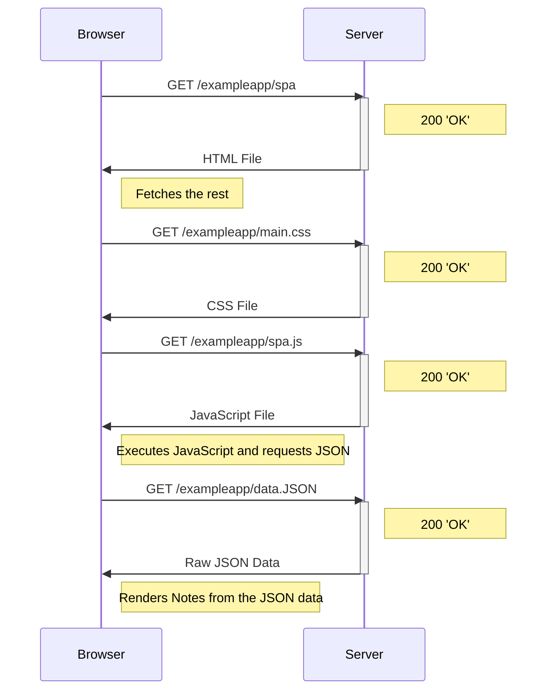

The sequence for visiting the Notes page for the Single-Page version of the app is more-or-less identical to the original. The only difference is the code for handling the form. The only way a user would notice this is by submitting something to that form.

