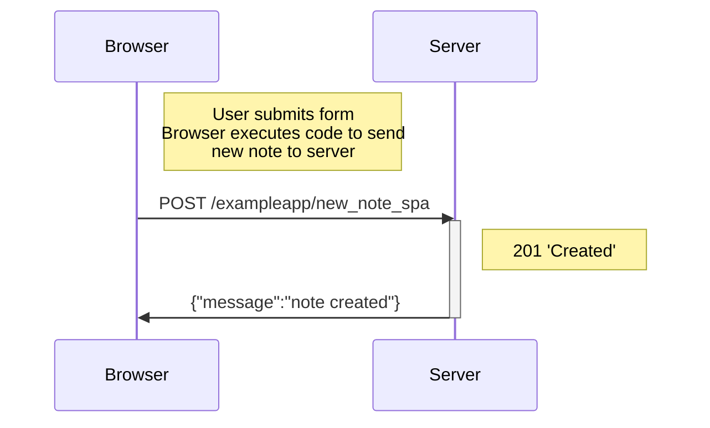

In the single-page version of the app, when the user submits the form, the page executes the JavaScript code to create a new note, which is pushed to the list of elements in the JSON file. It sends the new note with an application/json header to the server, then rerenders the notes list. 

